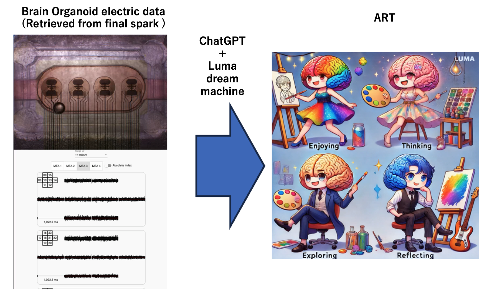

# Brain Organoid Computing: Future Directions and Applications

## Overview

This project explores the potential of using brain organoids for computing tasks. Brain organoids are three-dimensional structures grown from stem cells that replicate many features of the human brain. By leveraging the biological intelligence of brain organoids, we aim to perform various computational tasks such as generative tasks, recognition tasks, and robot control.

The process of creating brain organoids involves several steps:
1. **Skin Cell**: The process begins with skin cells.
2. **iPS Cell**: Skin cells are reprogrammed into induced pluripotent stem (iPS) cells.
3. **Brain Organoid**: iPS cells are then differentiated into brain organoids.

This project will apply this brain organoid for a variety of computer tasks!

## Potential Applications

1. **Parallel Computing Server & Cloud Computing**: Utilizing brain organoids for large-scale parallel computing and cloud services. By creating large, parallelized brain organoids, we will achieve computational power that rivals or exceeds human intelligence (AGI: Artificial General Intelligence) and potentially even superintelligent systems (ASI: Artificial Super Intelligence).
   - **Achieving AGI**: By scaling up the size and complexity of brain organoids, we will simulate neural networks that are comparable to the human brain in terms of processing power and efficiency. This involves creating extensive neural connections and optimizing them for various cognitive tasks.
   - **Transitioning to ASI**: Once AGI is achieved, further enhancements will be made by increasing the parallel processing capabilities, integrating advanced learning algorithms, and continually expanding the neural network infrastructure. This will allow the system to surpass human cognitive abilities and achieve ASI.

2. **AI Programming**: Developing AI programs that leverage the unique capabilities of brain organoids, including advanced pattern recognition and decision-making processes.

3. **Brain USB (I/O for Brain)**: Creating interfaces that allow direct input and output with brain organoids, which could revolutionize how we interact with computational systems.

4. **Beating Psychological Diseases**: Using brain organoids to understand and develop treatments for psychological diseases. By studying the brain-like structures, researchers can gain insights into mental health conditions and develop new therapeutic approaches.

## Future Directions

1. **Develop Code to Utilize Brain Organoid Cloud Services for MNIST Recognition**: Create and optimize code that leverages brain organoid cloud services to recognize and interpret MNIST datasets.
2. **Create AI YouTuber Using Brain Organoids**: Develop a virtual YouTuber (AI YouTuber) powered by brain organoids, capable of generating content and interacting with viewers in real-time.
3. **Optimize and Miniaturize MAE Sensors for Brain Organoids**: Focus on the optimization, miniaturization, and parallelization of Multi-Electrode Arrays (MEA) to enhance the interaction with brain organoids.
4. **Cloud Service for AI Using Brain Organoids**: Develop a cloud-based service that utilizes brain organoids specifically designed for AI applications.

## NEWS

By using FinalSpark company's site live of brain organoid, and processing by chatGPT and Luma dream machine, dancing image art is got. 

## Contact

**Kenta Kitamura (MD)**  
PhD Candidate of Information Theory  
Email: [kitamura.kenta.1988@gmail.com](mailto:kitamura.kenta.1988@gmail.com)
